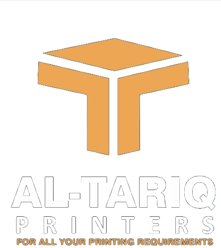

# AlTariq Photoroom Pro 🖼️✂️

**Al Tariq Printers** ka apna offline **AI background remover & product-photo studio** — Photoroom jaisa, magar **full quality (pixel kharab nahi), HD edges, offline, aur bilkul free** (koi account/fees nahi).



---

## ✨ Kya kar sakta hai

- **✂️ AI Background Remove** — ek click mein kisi bhi product/person ka background hatao
- **🧵 HD Edges (Alpha Matting)** — baal aur soft kinare bhi saaf, jagged pixel nahi
- **🎨 Naya Background** — Transparent / White / Black / **Al Tariq Orange** / Studio grey / Gradient / **apni koi image**
- **📐 Size Presets** — Original (best quality), Marketplace 1000², Instagram Post/Story, **A4 300dpi**, Business Card 300dpi
- **🗂️ Batch** — ek saath kai tasveerein — "Sab ka BG hatao" + "Sab Export Karein"
- **💾 Lossless PNG** ya JPG export — quality full
- **🔌 100% Offline** — internet ki zaroorat nahi, data aapke PC pe hi rehta hai

> **Photoroom se behtar kaise?** Photoroom HD download aur batch pe paise leta hai aur cloud pe upload karta hai. Ye tool sab kuch **local, full-resolution aur free** deta hai — printing press ke rozana kaam ke liye banaya gaya.

---

## ⬇️ EXE download karna (aasan tareeqa)

Aapko kuch install/build nahi karna. Jab bhi tool update hota hai, GitHub **khud Windows pe exe bana deta hai**:

1. Is repo ke **Releases** page pe jao → **"AlTariq Photoroom Pro"**
2. **`AlTariqPhotoroomPro.exe`** download karo
3. Double-click karo — bas! (Windows 10/11)

> Pehli baar Windows "SmartScreen" warning de sakta hai (kyunki exe naya hai) →
> **More info → Run anyway** dabao. Ye normal hai.

Ya phir **Actions** tab → latest run → niche **Artifacts** se bhi exe milta hai.

---

## 🛠️ Khud build karna (optional — Windows PC pe)

Agar aap apne PC pe banana chaho:

```bat
:: Python 3.11 install hona chahiye
cd tool
build.bat
```

Ban jaane par exe yahan milega: `tool\dist\AlTariqPhotoroomPro.exe`

---

## 🧩 Behtar quality chahiye? (advanced)

Default AI model `isnet-general-use` hai (bahut acha + tez). Agar aur bhi sharp
edges chahiye to `tool/bg_engine.py` mein model badal do:

```python
MODEL_NAME = os.environ.get("ALTARIQ_MODEL", "birefnet-general-lite")
```

…aur `.github/workflows/build-tool.yml` ke download step mein bhi wahi naam
daal do. Ye model thoda bada hai magar edges aur behtar aate hain.

---

## 🧱 Andar kya hai (tech)

| Cheez | Istemaal |
|------|----------|
| `app.py` | Native window (pywebview) + Python↔JS bridge |
| `bg_engine.py` | AI cutout, background compose, export (rembg + Pillow) |
| `ui/` | Branded interface (Al Tariq orange/gold 3D theme) |
| `altariq_photoroom_pro.spec` | PyInstaller — sab kuch ek exe mein |
| `.github/workflows/build-tool.yml` | Windows pe exe auto-build + Release |

Made for **Al Tariq Printers — For all your printing requirements.**
